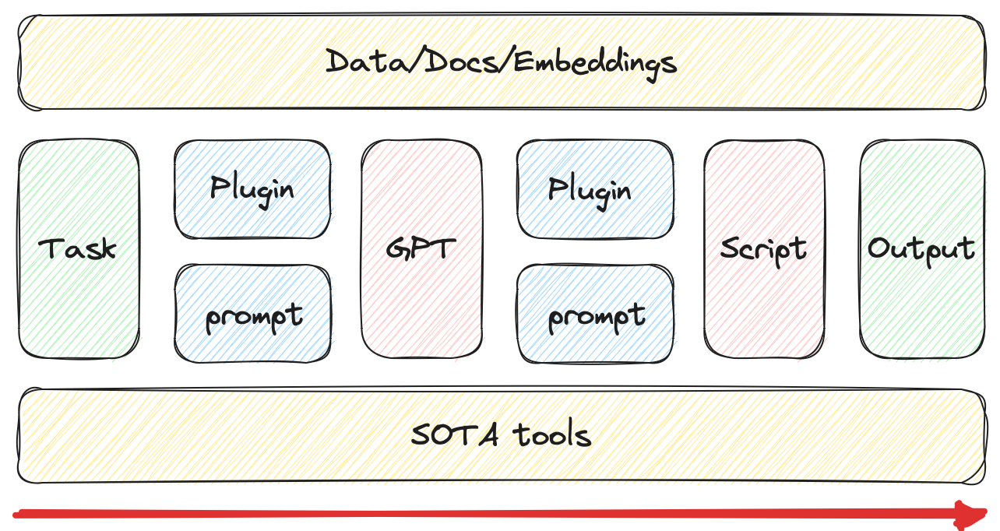

# ALE-GPT
Accumulate, Learn, Evolve with current.

# Learners
## 1. Scholar
- Survey topics
- Brainstorm
- Experiments with demos
- Write papers
- Interaction & Teach

## 2. Historian
- Read history
- Analysis current event

## 3. ?
- Learn from others' life
